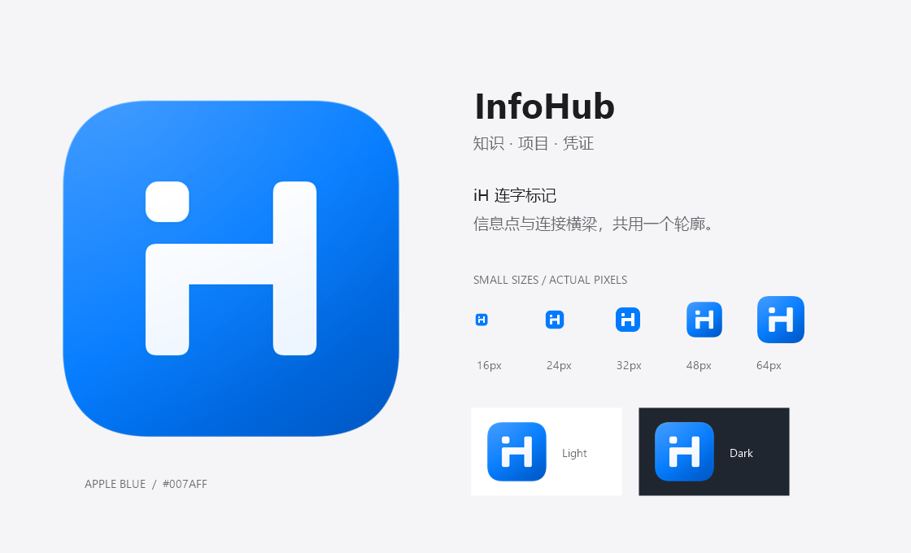

# InfoHub 应用图标

图形将信息的 **i** 与 **Hub 的 H** 合成一个连字：左上信息点、共享横梁和右侧竖笔。采用现有设计系统的 Apple Blue `#007AFF`，配白色标记、连续圆角和轻微高光，适配亮色玻璃工作台。



| 文件                                   | 用途                                                     |
| -------------------------------------- | -------------------------------------------------------- |
| `infohub.svg`                          | 1024 × 1024 矢量主稿；背景四角透明，无外部字体或图片依赖 |
| `infohub-small.svg`                    | 为 16–32 px 调整过笔画、间隔和像素位置的小尺寸稿         |
| `infohub-mark.svg`                     | 单色标记，使用 `currentColor`，用于无需蓝色底板的场景    |
| `infohub-1024.png` / `infohub-512.png` | 透明背景 PNG，适合设计交付与应用展示                     |
| `preview.png`                          | 主图、16/24/32/48/64 px 实际尺寸及浅深背景对照           |

桌面图标位于 `src-tauri/icons/`；Windows ICO 包含 16、24、32、48、64、128、256 px 七档，16–32 px 使用专门的小尺寸稿。macOS ICNS 和 Windows Store PNG 使用同一主稿。网页图标位于 `public/favicon.svg`、`public/favicon.ico`；48 px 登录图标使用 `public/app-icon.svg`。

修改 SVG 后运行：

```powershell
npm run icons
./scripts/preview-icons.ps1
npm run tauri -- build --debug --no-bundle
./scripts/verify-icon.ps1
```

`npm run icons` 使用项目已安装的 Tauri CLI，无新增生成依赖。中间输出放在 `.local/infohub-icons/`；生产目录仅复制需要的图标。预览脚本使用 Windows 自带的 System.Drawing。

`src-tauri/build.rs` 显式监听图标目录，保证只改图标时 Windows 资源也会重新编译。图标已用于网页标签、工作台页头、登录页及桌面构建配置；它是静态品牌标识，不是窗口操作按钮。
